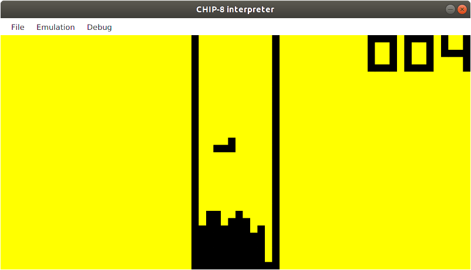
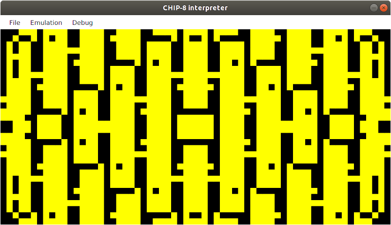
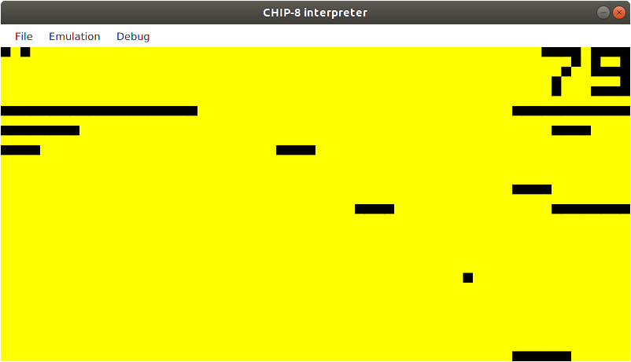

# CHIP-8-interpreter
👾 A simple CHIP-8 interpreter written in Java.

# What is it?
Chip-8 is a simple, interpreted, programming language which was first used on some do-it-yourself computer systems in the late 1970s and early 1980s. The COSMAC VIP, DREAM 6800, and ETI 660 computers are a few examples.

# Installation

Things you need:
- `java`
- `maven`

```sh
$ git clone https://github.com/Kowies/CHIP-8-interpreter.git
$ mvn compiler:compile
```

# Usage

Exec:
```sh
$ mvn exec:java
```
Tests:
```sh
$ mvn test
```

# Screenshots

*Astro Dodge:*


*Tetris:*



*Kaleidoscope:*



*Breakout:*



# Controls

| Chip 8 Key | Keyboard Key |
| :--------: | :----------: |
| `0 1 2 3`  | `1 2 3 4`    |
| `4 5 6 7`  | `Q W E R`    |
| `8 9 A B`  | `A S D F`    |
| `C D E F`  | `Z X C V`    |

# Features

- save / load system
- debug mode

# License
Licensed under [MIT](LICENSE.md) license. Copyright (c) 2019 Michał Kowieski
